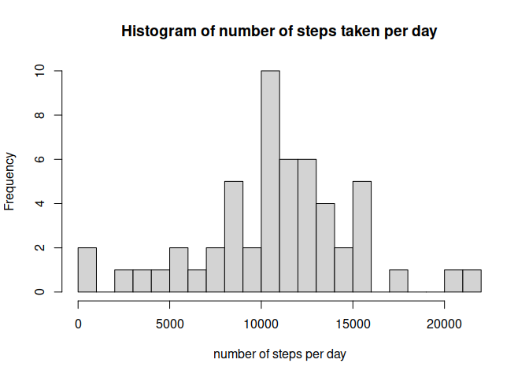
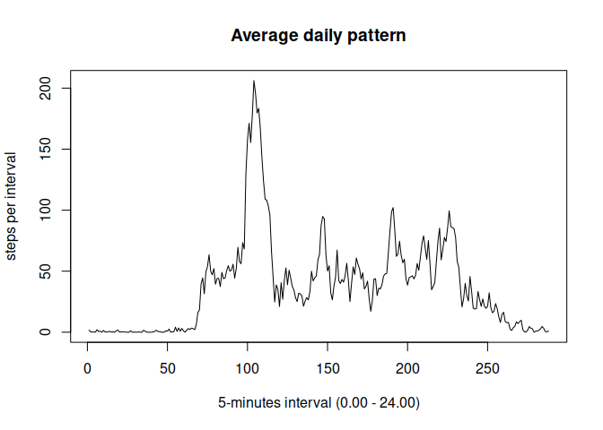
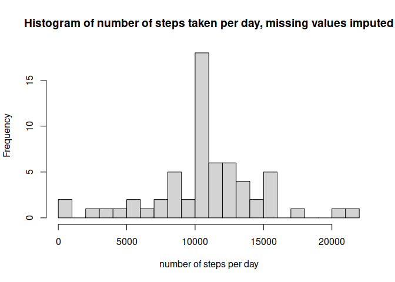
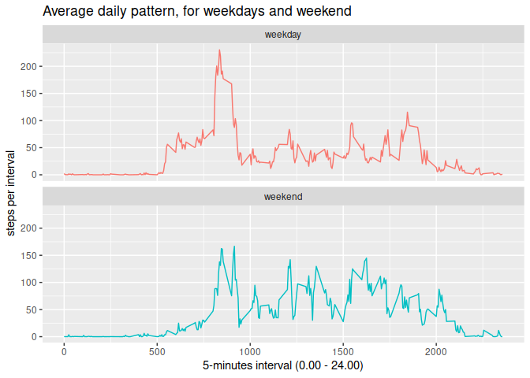

## Loading and preprocessing the data
The file is present as a zip file in the working directory, it needs to be unzipped, if this has not been done before, and then read, and have a look.


```r
if(!file.exists("activity.csv")) {
        activity <- unzip(zipfile='repdata_data_activity.zip')
        
}
activity <- read.csv("activity.csv")
head(activity)
```

```
##   steps       date interval
## 1    NA 2012-10-01        0
## 2    NA 2012-10-01        5
## 3    NA 2012-10-01       10
## 4    NA 2012-10-01       15
## 5    NA 2012-10-01       20
## 6    NA 2012-10-01       25
```
Steps and interval are integers, that looks fine. But date column is in string, and needs to be in a date format. This is done by lubridate's ymd function.


```r
library(lubridate)
```

```
## 
## Attaching package: 'lubridate'
```

```
## The following objects are masked from 'package:base':
## 
##     date, intersect, setdiff, union
```

```r
activity$date <- ymd(activity$date)
head(activity)
```

```
##   steps       date interval
## 1    NA 2012-10-01        0
## 2    NA 2012-10-01        5
## 3    NA 2012-10-01       10
## 4    NA 2012-10-01       15
## 5    NA 2012-10-01       20
## 6    NA 2012-10-01       25
```


## What is mean total number of steps taken per day?
* *Calculate the total number of steps taken per day*
* *Make a histogram of the total number of steps taken each day*
* *Calculate and report the mean and median of the total number of steps taken per day*

```r
# the steps per day are calculated by aggregate function
stepsperday <- aggregate(activity$steps, by=list(activity$date), sum)
# now mean and  median can be calculated
stepsmean <- mean(stepsperday$x, na.rm=TRUE)
stepsmedian <- median(stepsperday$x, na.rm=TRUE)

# plot a histogram of the steps per day
hist(stepsperday$x, breaks=20, main="Histogram of number of steps taken per day", xlab = 'number of steps per day')
```

<!-- -->

**The mean of the total number of steps taken per day is 1.0766189\times 10^{4}, and the median is 10765.**

## What is the average daily activity pattern?
* *Make a time series plot (i.e. type = "l") of the 5-minute interval (x-axis) and the average number of steps taken, averaged across all days (y-axis)*


```r
dailypattern <- aggregate(activity$steps, by=list(activity$interval), mean, na.rm=TRUE)
plot(dailypattern$x, type="l", main = "Average daily pattern", xlab = "5-minutes interval (0.00 - 24.00)", ylab = "steps per interval")
```

<!-- -->

* *Which 5-minute interval, on average across all the days in the dataset, contains the maximum number of steps?*


```r
# find the maximum number of steps
maxsteps <- max(dailypattern$x)
maxint <- which.max(dailypattern$x)
maxtime <- activity$interval[maxint]
```

**The average daily pattern shows the highest value for the number of steps in the 5-min interval: 104, which corresponds to 835 o'clock, when the number of steps is 206.1698113.**

## Imputing missing values
*Note that there are a number of days/intervals where there are missing values (coded as NA). The presence of missing days may introduce bias into some calculations or summaries of the data.*

* *Calculate and report the total number of missing values in the dataset (i.e. the total number of rows with NAs)*


```r
missingvalues <- sum(is.na(activity$steps))
missingperc <- mean(is.na(activity$steps))
```

**The number of rows with missing values is 2304, which is 0.1311475 %.**

* *Devise a strategy for filling in all of the missing values in the dataset. The strategy does not need to be sophisticated. For example, you could use the mean/median for that day, or the mean for that 5-minute interval, etc*.
* *Create a new dataset that is equal to the original dataset but with the missing data filled in.*

Filling missing values with mean value for the interval seems like a fine strategy to me. A new dataset is created, named activity_nona, in which the missing values are replaced by the value previously calculated for the daily pattern (stepsperinterval, specific value is found by using match function).


```r
activity_nona <- activity             #copying dataset
idxna <- is.na(activity_nona$steps)   #find missing values
activity_nona$steps[idxna] <- dailypattern$x[match(activity_nona$interval[idxna], dailypattern$Group.1)]            #replace missing values with average in the daily pattern

# check is all na's are replaced
idxna_check <- sum(is.na(activity_nona$steps))
idxna_check   #should be zero
```

```
## [1] 0
```

* *Make a histogram of the total number of steps taken each day and Calculate and report the mean and median total number of steps taken per day. Do these values differ from the estimates from the first part of the assignment? What is the impact of imputing missing data on the estimates of the total daily number of steps?*

This will repeat the calculations for the first histogram with the new dataset.


```r
# the steps per day are calculated by aggregate function
stepsperday_nona <- aggregate(activity_nona$steps, by=list(activity_nona$date), sum)
# now mean and  median can be calculated
stepsmean_nona <- mean(stepsperday_nona$x, na.rm=TRUE)
stepsmedian_nona <- median(stepsperday_nona$x, na.rm=TRUE)

# plot a histogram of the steps per day
hist(stepsperday_nona$x, breaks=20, main="Histogram of number of steps taken per day, missing values imputed", xlab = 'number of steps per day')
```

<!-- -->

**The mean of the total number of steps taken per day of the original dataset is 1.0766189\times 10^{4}, and the median is 10765.**
**The recalculated mean of the total number of steps taken per day with imputing missing values is 1.0766189\times 10^{4}, and the median is 1.0766189\times 10^{4}.**
**It can be concluded that mean and median do not change from the imputing procedure.**

## Are there differences in activity patterns between weekdays and weekends?
* *Create a new factor variable in the dataset with two levels – “weekday” and “weekend” indicating whether a given date is a weekday or weekend day.*

First make a new variable with the day of the week from weekdays command, then substitute result by weekday or weekend, as factor.


```r
activity_nona$day <- weekdays(activity_nona$date)
activity_nona$day <- as.factor(gsub(pattern = "Monday|Tuesday|Wednesday|Thursday|Friday", replacement = "weekday", x = activity_nona$day))
activity_nona$day <- as.factor(gsub(pattern = "Saturday|Sunday", replacement = "weekend", x = activity_nona$day))
```

* *Make a panel plot containing a time series plot (i.e. type = "l") of the 5-minute interval (x-axis) and the average number of steps taken, averaged across all weekday days or weekend days (y-axis). See the README file in the GitHub repository to see an example of what this plot should look like using simulated data.*

Repeat plotting of calculation and plot for daily pattern, but for data separated on weekday/weekend

```r
dailypattern2 <- aggregate(activity_nona$steps, by=list(activity_nona$interval, activity_nona$day), mean)
#separate data file
dailypattern_wd <- dailypattern2[dailypattern2$Group.2 == "weekday",]
dailypattern_we <- dailypattern2[dailypattern2$Group.2 == "weekend",]
library(ggplot2)
d <- ggplot(dailypattern2, aes(Group.1, x))#, colour=Group.2)
d + geom_line() + aes(colour = Group.2) + labs(title = "Average daily pattern, for weekdays and weekend", x = "5-minutes interval (0.00 - 24.00)", y = "steps per interval") + facet_wrap(~`Group.2` , ncol = 1, nrow=2) + theme(legend.position = "none")
```

<!-- -->
